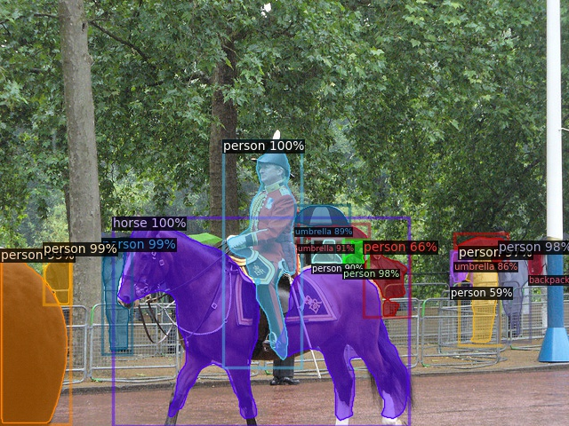
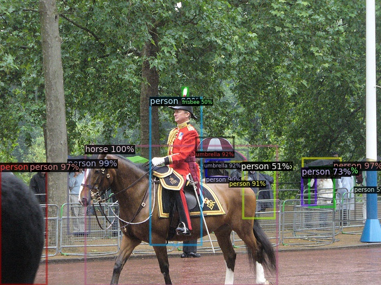
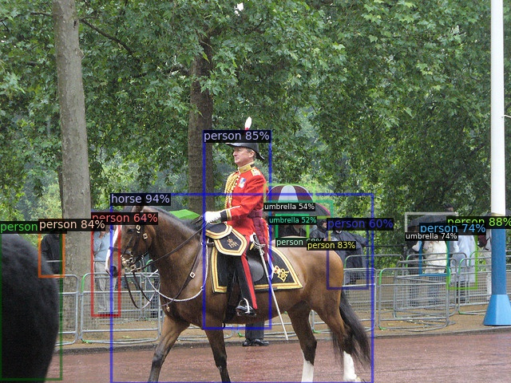

## Input


# Masking

<details close>
<summary>Terminal command</summary>

```
python demo.py --config-file ../configs/COCO-InstanceSegmentation/mask_rcnn_R_50_FPN_3x.yaml --input ../../input.jpg --output output.jpg --opts MODEL.DEVICE cpu MODEL.WEIGHTS detectron2://COCO-InstanceSegmentation/mask_rcnn_R_50_FPN_3x/137849600/model_final_f10217.pkl
```
</details>

15 instances in 3.19s

## Mask_rcnn_R_50_FPN_3x



# Detection proposal-based

## Faster_rcnn_R_101_FPN_3x

17 instances in 4.23s



# Detection proposal-free

## Retinanet_R_101_FPN_3x

13 instances in 3.83s



# Panoptic detection

## Panoptic_fpn_R_50_3x.yaml


